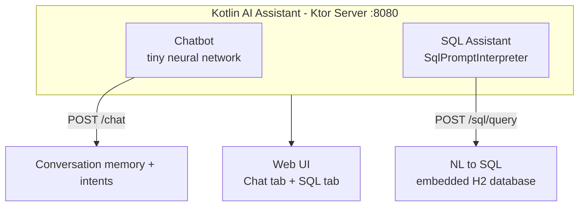
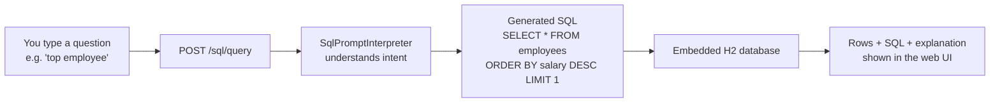

# Kotlin AI Assistant  (built with help from AI)

A lightweight AI assistant built entirely in Kotlin, running directly in the JVM — no external
AI APIs, no TensorFlow, no Python dependencies. It ships **two assistants in one**:

- **💬 Chatbot** — a tiny neural-network chat assistant that understands Czech and English
- **🗄️ SQL Assistant** — a natural-language → SQL engine that understands what you *mean*
  and translates it into real SQL against an embedded H2 database



> 📚 **Full documentation**
> - [**SQL Assistant docs**](docs/SQLAssistant.md) — how it understands natural language,
>   every supported prompt with generated SQL, complete synonym catalog, architecture
> - [**Chatbot docs**](docs/Chatbot.md) — features, chat API, model internals

---

## 🗄️ SQL Assistant (main focus)

The **SQL Assistant** is the flagship feature: you type a plain-English (or plain-Czech 🇨🇿)
question and it *understands* it, translates it into a real SQL query, runs it against the
embedded H2 database, and shows you the results — **plus the generated SQL and a
human-readable explanation**.



### "It understands human language"

The interpreter is **schema-driven**: it reads the live database schema
(`GET /sql/schema`) instead of hardcoding table names. When you say **"top employee"**, it:

1. Recognizes `top` as an aggregation word for `MAX`
2. Recognizes `employee` as the `employees` table (singular/plural inflection)
3. Picks the natural numeric column — `salary` — because `id` / `*_id` columns are skipped
4. Builds `SELECT * FROM employees ORDER BY salary DESC LIMIT 1`

That's the *"top employee → select employee with highest salary"* translation. The same
engine handles counting, filtering (`find employees in Engineering`), joins
(`join employees and departments`), grouped aggregations (`average salary by department`),
extremes (`cheapest product`), bare conditions (`price > 900`), raw SQL passthrough — in
**English and Czech**. Every supported phrase and every synonym is catalogued in the
[SQL Assistant docs](docs/SQLAssistant.md).

### SQL quick start

```bash
./gradlew run        # server starts at http://localhost:8080
```

Open `http://localhost:8080`, switch to the **SQL** tab and type a prompt (the UI shows
example prompts as clickable chips), or call the API:

```bash
curl -X POST http://localhost:8080/sql/query \
  -H "Content-Type: application/json" \
  -d '{"prompt": "top employee"}'
```

| SQL endpoint | Purpose |
|--------------|---------|
| `POST /sql/query` | Natural language prompt → SQL → results |
| `POST /sql/execute` | Raw SQL execution (power users) |
| `GET /sql/schema` | Live database schema (tables & columns) |
| `GET /sql/prompts` | Example prompts shown as chips in the UI |


*The SQL tab in the web UI — prompt chips, natural-language input, generated SQL + explanation, results.*

---

## 💬 Chatbot

A tiny feedforward neural network (embedding → hidden → softmax, ~320 parameters) classifies
10 intent types in Czech and English, backed by in-memory conversation memory.

```bash
curl -X POST http://localhost:8080/chat \
  -H "Content-Type: application/json" \
  -d '{"message": "Ahoj, jak se máš?", "sessionId": "user123"}'
```

| Chat endpoint | Purpose |
|---------------|---------|
| `POST /chat` | Send a message, get an intent-classified reply |
| `GET /chat/history?sessionId=...` | Conversation history |
| `POST /chat/clear` | Clear session history |
| `GET /status` | Model information |

Full details — features, API reference, model internals, project structure — are in the
[Chatbot docs](docs/Chatbot.md).

---

## Quick start (both)

```bash
./gradlew run        # http://localhost:8080 — Chat tab + SQL tab
```

| Component | Docs | Endpoints |
|-----------|------|-----------|
| 💬 Chatbot | [Chatbot.md](docs/Chatbot.md) | `/chat`, `/chat/history`, `/chat/clear`, `/status` |
| 🗄️ SQL Assistant | [SQLAssistant.md](docs/SQLAssistant.md) | `/sql/query`, `/sql/execute`, `/sql/schema`, `/sql/prompts` |

## Tech stack

| Component | Technology |
|-----------|-----------|
| Language | Kotlin (JVM) |
| Web Server | Ktor (Netty) |
| Serialization | kotlinx-serialization-json |
| Chat model | Pure Kotlin neural network (no external AI libs) |
| SQL database | Embedded H2 + HikariCP connection pool |
| SQL translation | `SqlPromptInterpreter` — schema-driven, regex-pattern based NL→SQL |

## Project structure

```
kotlin_ai_assistant/
├── build.gradle.kts              # Gradle build with Ktor + dependencies
├── README.md                     # ← you are here
├── docs/
│   ├── SQLAssistant.md           # SQL Assistant docs (main focus)
│   ├── Chatbot.md                # Chatbot docs
│   └── sql/                      # SQL docs detail: how-it-works, examples,
│                                 # synonyms, architecture + screenshots
└── src/
    └── main/
        ├── kotlin/com/assistant/
        │   ├── Application.kt                    # Server entry point, wiring
        │   ├── model/                            # SimpleTokenizer + TinyNeuralNetwork
        │   ├── memory/                           # ConversationMemory
        │   ├── database/                         # DatabaseManager + SqlPromptInterpreter
        │   └── routes/                           # ChatRoutes, SqlRoutes
        └── resources/
            └── web/index.html                    # Web UI (Chat tab + SQL tab)
```
