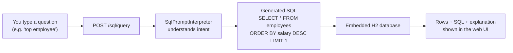
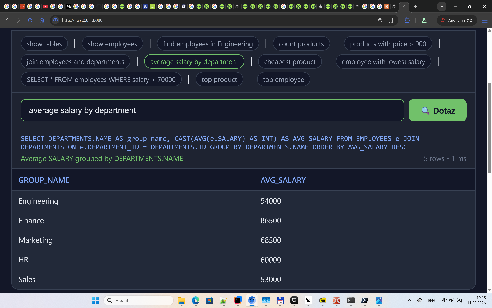

# SQL Assistant — Documentation

The **SQL Assistant** is a natural-language → SQL engine built into the Kotlin AI Assistant.
You type a plain-English (or plain-Czech 🇨🇿) question, and it *understands* what you mean,
translates it into a real SQL query, runs it against the embedded H2 database, and shows you
the results — plus the generated SQL and a human-readable explanation.



## What "understands human language" means

The interpreter is **schema-driven**: it knows the tables and columns because it *reads the live
database schema* (`GET /sql/schema`), not because table names are hardcoded. When you say
**"top employee"**, it:

1. Recognizes `top` as an aggregation word for `MAX`
2. Recognizes `employee` as the `employees` table (singular/plural inflection)
3. Picks the natural numeric column for a table — `salary` — because `id`/`*_id` columns are skipped
4. Builds `SELECT * FROM employees ORDER BY salary DESC LIMIT 1`

That is exactly the *"top employee → select employee with highest salary"* translation you see
in the screenshots. The full list of every supported phrase is in [examples.md](sql/examples.md),
and every word it understands is catalogued in [synonyms.md](sql/synonyms.md).

## Documentation index

| File | Contents |
|------|----------|
| [how-it-works.md](sql/how-it-works.md) | The full translation pipeline: normalize → route → resolve → build SQL |
| [examples.md](sql/examples.md) | **Every supported prompt**, with generated SQL, explanation, and screenshots |
| [synonyms.md](sql/synonyms.md) | **Complete word lists**: English + Czech keywords, column aliases, value matching |
| [architecture.md](sql/architecture.md) | Request flow through the Ktor routes, interpreter components, database schema |

## Quick start

```bash
./gradlew run        # server starts at http://localhost:8080
```

Open `http://localhost:8080`, switch to the **SQL** tab, and type one of the example prompts
(the UI shows them as clickable chips). Or call the API directly:

```bash
curl -X POST http://localhost:8080/sql/query \
  -H "Content-Type: application/json" \
  -d '{"prompt": "top employee"}'
```

## API endpoints

| Endpoint | Purpose |
|----------|---------|
| `POST /sql/query` | Natural language prompt → SQL → results |
| `POST /sql/execute` | Raw SQL execution (power users) |
| `GET /sql/schema` | Live database schema (tables & columns) |
| `GET /sql/prompts` | Example prompts shown as chips in the UI |

## Screenshots

The web UI in action (full-resolution PNGs in this folder):


*Select Sql tab on main page and then example query.*

| Screenshot | Shows |
|------------|-------|
| [top_employee.png](sql/top_employee.png) | `top employee` → highest-salary employee |
| [top_product.png](sql/top_product.png) | `top product` → most expensive product |
| [average_salary.png](sql/average_salary.png) | `average salary by department` → grouped AVG |
| [raw_sql.png](sql/raw_sql.png) | Raw SQL passthrough + `POST /sql/execute` |
