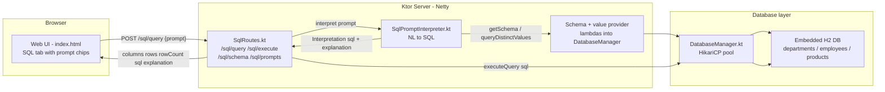
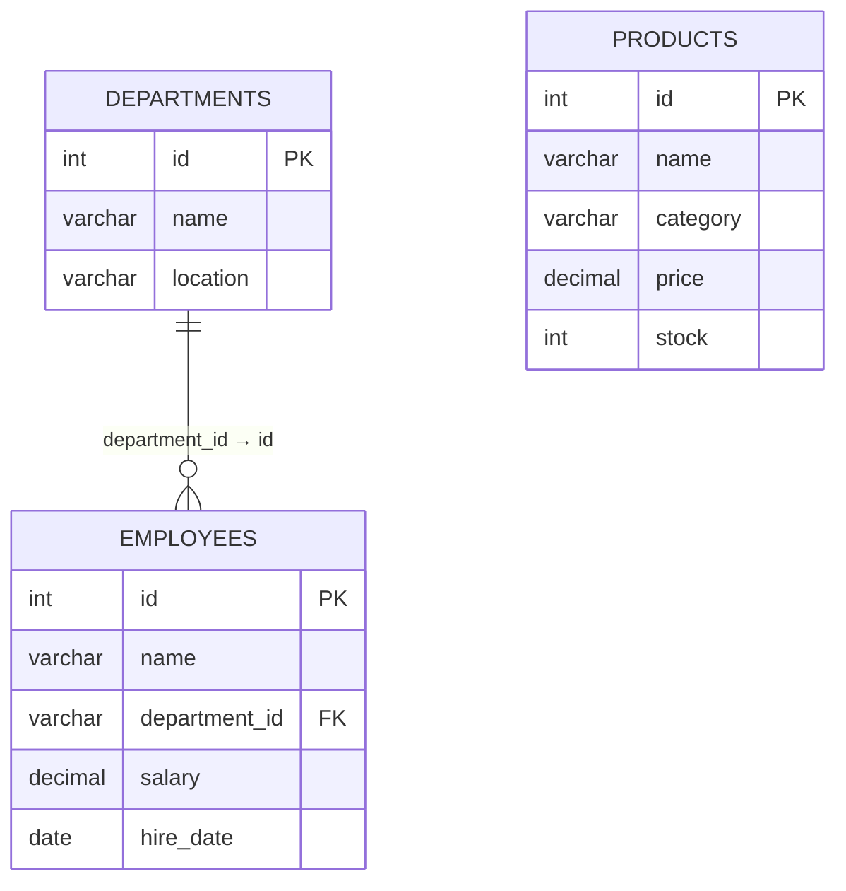
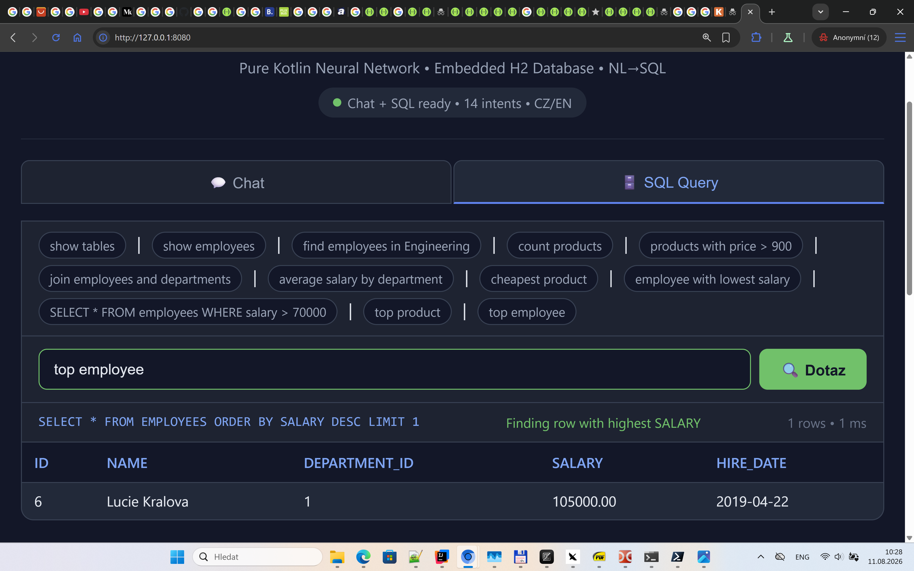

# Architecture — The SQL Assistant End-to-End

This page walks through the components that make the SQL assistant work, from the web UI
down to the embedded H2 database.

## Component map



## 1. Web UI (`src/main/resources/web/index.html`)

- The page has two tabs: **Chat** and **SQL**.
- The SQL tab renders a prompt input with the placeholder
  *"Napište dotaz přirozeným jazykem..."* ("write your query in natural language").
- On tab switch, `loadSqlPrompts()` fetches `GET /sql/prompts` and renders the example prompts
  as clickable **chips** — clicking one fills the input.
- `sendSqlPrompt()` POSTs to `/sql/query` and renders the response: the generated SQL
  (monospace, blue), the explanation (green), the result table, and the execution time.


*The SQL tab: prompt chips at the top, prompt input, generated SQL + explanation, result grid.*

## 2. HTTP layer (`SqlRoutes.kt`)

| Route | Body | Behavior |
|-------|------|----------|
| `POST /sql/query` | `{"prompt": "top employee"}` | Natural language → interpreter → SQL → execute → results |
| `POST /sql/execute` | `{"sql": "SELECT ..."}` | Raw SQL executed directly (power users) |
| `GET /sql/schema` | — | Serializes `db.getSchema()` as `SqlTableDef`/`SqlColumnDef` list |
| `GET /sql/prompts` | — | Returns `db.examplePrompts()` (the 12 prompt chips) |

`/sql/query` flow:

1. Trim the prompt; reject empty with `400`.
2. `interpreter.interpret(prompt)` → `Interpretation(sql, explanation)`.
3. If `sql` is blank → respond with just the explanation (help case).
4. Else `db.executeQuery(sql)` → `(columns, rows, rowCount)`.
5. Respond `{sql, explanation, columns, rows, rowCount, executionTimeMs}`.
6. Any exception → `400` with `explanation = "Error: ..."`.

## 3. The interpreter (`SqlPromptInterpreter.kt`)

Constructed with two lambdas so it stays decoupled from the database:

```kotlin
SqlPromptInterpreter(
    schemaProvider = { db.getSchema() },                  // -> List<TableInfo>
    valueQuery     = { table, col -> db.queryDistinctValues(table, col) }
)
```

Internal state (all lazy, all derived from the live schema):

| Member | Type | Built from |
|--------|------|-----------|
| `schema` | `List<TableInfo>` | `schemaProvider()` |
| `tableIndex` | `Map<String, TableInfo>` | table names, lowercase |
| `columnIndex` | `Map<String, List<FieldRef>>` | every column of every table |
| `columnSynonyms` | `Map<String, String>` | derived aliases + `COLUMN_ALIASES` |
| `knownValues` | `Map<String, List<FieldRef>>` | `SELECT DISTINCT` per text column |

The `interpret()` entry point is a **chain of sub-interpreters**, each returning `null` on
no-match (see [how-it-works.md](how-it-works.md) for the full diagram):

```text
select passthrough → show tables → help
→ show(table) → bareTable → describe
→ count/find+condition → aggregation → table+where → join → bare condition → DUNNO
```

Key design decisions:

- **Schema-driven, zero hardcoding** — no table/column/department names in the interpreter
  (department names come from `knownValues`).
- **FK inference by convention** — columns ending in `_id` whose stem matches a table name are
  treated as foreign keys (`department_id` → `departments`), enabling automatic joins and
  subqueries.
- **Return type is `Interpretation(sql, explanation)`** — the explanation string is what the UI
  shows as the green "understood as" text, and doubles as human-readable feedback.

## 4. Database layer (`DatabaseManager.kt`)

- Embedded **H2** database (`jdbc:h2:mem:assistant_db;MODE=PostgreSQL`) with a **HikariCP**
  connection pool.
- On startup it seeds schema and demo data idempotently (skips seeding if rows already exist).

### Schema



| Table | Columns | Seed data |
|-------|---------|-----------|
| `departments` | `id`, `name`, `location` | 5 rows (Engineering, Marketing, Sales, HR, Finance) |
| `employees` | `id`, `name`, `department_id` (FK), `salary`, `hire_date` | 10 rows, salaries 51 000–105 000 CZK |
| `products` | `id`, `name`, `category`, `price`, `stock` | 10 rows, 4 categories |

### Public API

```kotlin
fun getSchema(): List<TableInfo>                                   // SHOW TABLES + INFORMATION_SCHEMA
fun executeQuery(sql: String): Triple<List<String>, List<List<String>>, Int>  // columns, rows, count
fun executeUpdate(sql: String): Int                                // INSERT/UPDATE/DELETE/DDL
fun queryDistinctValues(table: String, column: String): List<String>  // feeds knownValues
fun examplePrompts(): List<String>                                 // the 12 UI chips
```

## 5. Example flow: `top employee`

1. UI chip or typed text sends `{"prompt": "top employee"}` to `/sql/query`.
2. `interpret()` normalizes to `top employee`, hits `aggregation()`.
3. `top` → MAX function; `employee` resolves as table; `pickNumericCol` picks `salary`
   (skips `id`, `department_id`).
4. MAX → `ORDER BY salary DESC LIMIT 1`.
5. `db.executeQuery(...)` returns Lucie Kralova (105 000 CZK).
6. UI shows `SELECT * FROM employees ORDER BY salary DESC LIMIT 1`, the explanation
   *"Finding row with highest salary"*, and the result grid.



## 6. Related files

| File | Role |
|------|------|
| `src/main/kotlin/com/assistant/database/SqlPromptInterpreter.kt` | NL → SQL translation |
| `src/main/kotlin/com/assistant/database/DatabaseManager.kt` | H2 connection, seeding, execution |
| `src/main/kotlin/com/assistant/routes/SqlRoutes.kt` | HTTP endpoints |
| `src/main/kotlin/com/assistant/routes/request/SqlRequests.kt` | `SqlQueryRequest`, `SqlExecuteRequest` |
| `src/main/kotlin/com/assistant/routes/response/SqlResponses.kt` | `SqlQueryResponse`, `SqlSchemaResponse`, `SqlPromptsResponse` |
| `src/main/kotlin/com/assistant/Application.kt` | Wiring: builds `DatabaseManager` + `SqlPromptInterpreter` |
| `src/main/resources/web/index.html` | Web UI (SQL tab, chips, result grid) |
| `src/test/kotlin/com/assistant/database/SqlRoutesTest.kt` | End-to-end tests for ~17 prompts |
