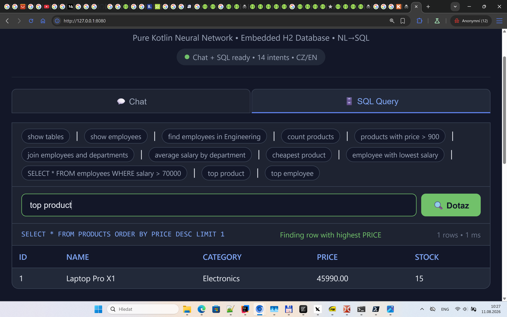
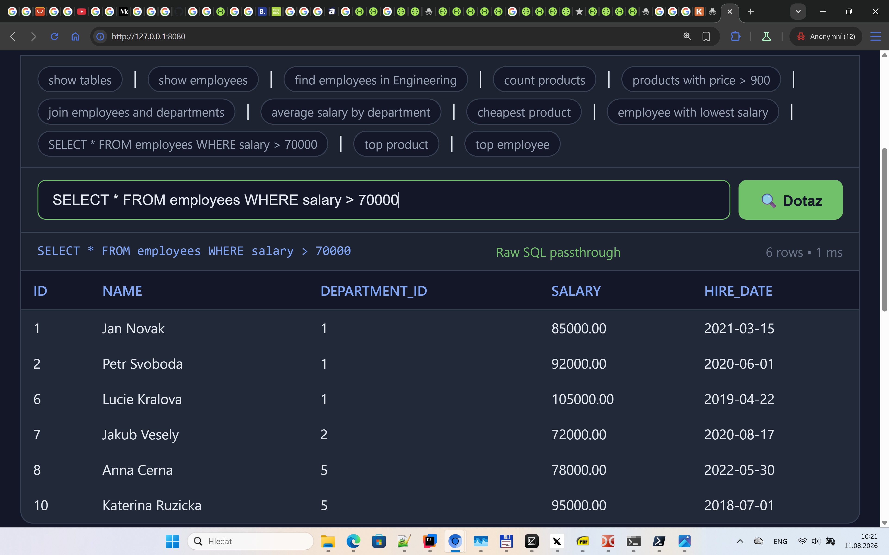

# SQL Prompt Examples — Complete Reference

Every prompt below is understood by the SQL assistant. For each one you get:

- the **prompt** you type,
- what the interpreter **understands** (the intent),
- the **generated SQL**,
- the **result** (on the seeded demo data),
- and a **screenshot** where one is available.

> All examples below were verified against the seeded demo database
> (`departments`, `employees`, `products`). They are also exercised by the test suite in
> `src/test/kotlin/com/assistant/database/SqlRoutesTest.kt`.

---

## 1. Table browsing

### `show tables`

The simplest prompt. Lists every table in the database.

- **Intent**: show all tables
- **Generated SQL**: `SHOW TABLES`
- **Result**: 3 rows — `DEPARTMENTS`, `EMPLOYEES`, `PRODUCTS`

Synonyms: `list tables`, `tables`.

---

### `show employees`

Displays all rows of a table.

- **Intent**: select all from the `employees` table
- **Generated SQL**: `SELECT * FROM employees`
- **Result**: 10 rows (all seeded employees)

Synonyms: `display employees`, `list employees`, `all employees`, `select employees`,
`zobraz employees` (Czech), `vsechny employees` (Czech).

---

### `show departments`

- **Generated SQL**: `SELECT * FROM departments`
- **Result**: 5 rows — Engineering, Marketing, Sales, HR, Finance (with locations).

---

### `employees` (bare table name)

You don't even need a verb — a bare table name is understood as "select everything".

- **Generated SQL**: `SELECT * FROM employees`

---

### `describe employees`

Shows the structure of a table (columns + types) instead of its data.

- **Intent**: describe table structure
- **Generated SQL**:
  ```sql
  SELECT COLUMN_NAME AS column, DATA_TYPE AS type
  FROM INFORMATION_SCHEMA.COLUMNS
  WHERE TABLE_NAME = 'employees'
  ```
- **Result**: `ID`, `NAME`, `DEPARTMENT_ID`, `SALARY`, `HIRE_DATE` with their types.

Synonyms: `structure employees`, `schema employees`, `info employees`.

---

## 2. Counting

### `count products`

- **Intent**: how many products exist
- **Generated SQL**: `SELECT COUNT(*) AS count FROM products`
- **Result**: 1 row — `10`

Synonyms: `how many products`, `pocet products`, `kolik products` (Czech).

### `count employees`

- **Generated SQL**: `SELECT COUNT(*) AS count FROM employees`
- **Result**: `10`

---

## 3. Filtering (find … in/with …)

### `find employees in Engineering`

This is where "understanding" shines. The interpreter resolves `Engineering` against the
**actual data** of the database: `Engineering` is a value in `departments.name`, and
`employees.department_id` is the foreign key to `departments.id`. So it generates a
**correlated subquery** — no hardcoded IDs.

- **Intent**: employees whose department is Engineering
- **Generated SQL**:
  ```sql
  SELECT * FROM employees
  WHERE department_id = (SELECT id FROM departments WHERE LOWER(name) = 'engineering')
  ```
- **Result**: 3 rows — Jan Novak, Petr Svoboda, Lucie Kralova

Synonyms for the verb: `search employees in Engineering`, `get employees in Engineering`,
`employees where Engineering`, `najdi employees v Engineering` (Czech).

---

### `products with price > 900`

A "table + condition" prompt. The condition `price > 900` is parsed by the condition resolver:
`price` is a known column, `>` is a recognized operator.

- **Intent**: products whose price is greater than 900
- **Generated SQL**: `SELECT * FROM products WHERE price > 900`
- **Result**: 8 rows (everything except Wireless Mouse 899 CZK and Water Bottle 399 CZK)

Other separators work too: `products from …`, `products where …`, `products v …` (Czech).

---

### `employee with lowest salary`

The `lowest` aggregation word combined with a table context (`employee`) and the field
`salary`. The interpreter peels off the leading table name and applies `ORDER BY salary ASC LIMIT 1`.

- **Intent**: the employee with the minimum salary
- **Generated SQL**: `SELECT * FROM employees ORDER BY salary ASC LIMIT 1`
- **Result**: David Hora — 51 000 CZK

---

### `product with lowest stock`

- **Generated SQL**: `SELECT * FROM products ORDER BY stock ASC LIMIT 1`
- **Result**: Standing Desk — 4 units in stock

---

## 4. Extremes: top / cheapest / most expensive

The headline example: **`top employee` means "select the employee with the highest salary"**.

How it works: `top` is a `MAX` aggregation word; `employee` is a table; a table used as a field
resolves to its best numeric column (`salary`, because `id` and `*_id` are skipped).

### `top employee`

- **Intent**: employee with the highest salary
- **Generated SQL**: `SELECT * FROM employees ORDER BY salary DESC LIMIT 1`
- **Result**: Lucie Kralova — 105 000 CZK


*The web UI translating `top employee` into `SELECT * FROM employees ORDER BY salary DESC LIMIT 1`.*

### `top product`

- **Intent**: most expensive product
- **Generated SQL**: `SELECT * FROM products ORDER BY price DESC LIMIT 1`
- **Result**: Laptop Pro X1 — 45 990 CZK


*`top product` resolves `product` → `products.price` and sorts descending.*

### `cheapest product`

- **Intent**: product with the minimum price
- **Generated SQL**: `SELECT * FROM products ORDER BY price ASC LIMIT 1`
- **Result**: Water Bottle 1L — 399 CZK

### `most expensive product`

- **Intent**: product with the maximum price
- **Generated SQL**: `SELECT * FROM products ORDER BY price DESC LIMIT 1`
- **Result**: Laptop Pro X1 — 45 990 CZK

---

## 5. Grouped aggregations

### `average salary by department`

The `by` keyword turns a simple aggregation into a grouped one. Because `salary` lives in
`employees` and the grouping field `department` in `departments`, the interpreter **infers the
foreign key** (`department_id` → `departments.id`) and generates a `JOIN` automatically.

- **Intent**: average salary per department
- **Generated SQL**:
  ```sql
  SELECT departments.name AS group_name,
         CAST(AVG(a.salary) AS INT) AS AVG_salary
  FROM employees a
  JOIN departments ON a.department_id = departments.id
  GROUP BY departments.name
  ORDER BY AVG_salary DESC
  ```
- **Result**: 5 rows — Engineering 94 000, Finance 86 500, Marketing 68 500, Sales 53 000, HR 60 000


*The grouped aggregation with automatic FK join — note `group_name` and `AVG_salary` in the result.*

### `sum price by category`

- **Intent**: total price per product category
- **Generated SQL**:
  ```sql
  SELECT products.category AS group_name,
         CAST(SUM(a.price) AS INT) AS SUM_price
  FROM products a
  GROUP BY products.category
  ORDER BY SUM_price DESC
  ```
- **Result**: 4 rows — one per category.

Other grouping words: `per`, `podle`, `dle` (Czech). Other aggregation functions: `min`, `max`,
`sum`, `average` (see [synonyms.md](synonyms.md) for the full list).

---

## 6. Joins

### `join employees and departments`

The interpreter finds the foreign key by convention (`employees.department_id` → `departments.id`)
and joins the two tables. Columns of the second table are **aliased** (`departments_name`) so they
don't collide with the first table's columns.

- **Intent**: employees with their department information
- **Generated SQL**:
  ```sql
  SELECT a.*,
         departments.id AS departments_id,
         departments.name AS departments_name,
         departments.location AS departments_location
  FROM employees a
  JOIN departments ON a.department_id = departments.id
  ```
- **Result**: 10 rows, each employee with department name + location.

Synonyms: `join employees with departments`, `spoj employees a departments` (Czech).

---

## 7. Bare conditions (field operator value)

### `price > 5000`

A condition without any table or verb. The interpreter resolves `price` (→ `products.price`)
and uses the operator directly.

- **Generated SQL**: `SELECT * FROM products WHERE price > 5000`
- **Result**: 4 rows — Laptop Pro X1, Office Chair Pro, Standing Desk, Monitor 27" 4K

### English operators

The words `equals`, `is` and `like` are translated to SQL:

| Prompt | Generated WHERE clause |
|--------|------------------------|
| `price is 8990` | `WHERE LOWER(price) = '8990'` |
| `price equals 8990` | `WHERE LOWER(price) = '8990'` |
| `category is Electronics` | `WHERE LOWER(category) = 'electronics'` |
| `name like Pro` | `WHERE LOWER(name) LIKE 'pro'` |

Supported operators: `>`, `<`, `>=`, `<=`, `=`, `!=`, `equals`, `is`, `like`.

---

## 8. Raw SQL passthrough

### `SELECT * FROM employees WHERE salary > 70000`

Any prompt starting with `select` is passed through **verbatim** — the interpreter trusts you and
executes your SQL directly.

- **Intent**: raw SQL passthrough
- **Generated SQL**: `SELECT * FROM employees WHERE salary > 70000` (exactly as typed)
- **Result**: 6 rows — everyone earning more than 70 000 CZK.


*Raw SQL typed in the prompt box is executed as-is; the UI shows the query and results.*

Power users can also skip the interpreter entirely with the dedicated endpoint:

```bash
curl -X POST http://localhost:8080/sql/execute \
  -H "Content-Type: application/json" \
  -d '{"sql": "SELECT name, salary FROM employees ORDER BY salary DESC LIMIT 3"}'
```

---

## 9. Help and fallback

### `help`

- **Intent**: show available tables and example patterns
- **Generated SQL**: *(none — help text only)*
- **Result**: explanation listing `departments, employees, products` and patterns like
  `show <table>`, `find <table> with <condition>`.

Synonyms: `prompts`, `examples`, `commands`, `napoveda`, `priklady` (Czech).

### `blargh blah blah`

- **Intent**: unrecognized
- **Generated SQL**: *(none)*
- **Result**: explanation `"I didn't understand"` — the `DUNNO` fallback, no crash.

---

## Quick lookup table

| # | Prompt | Generated SQL |
|---|--------|---------------|
| 1 | `show tables` | `SHOW TABLES` |
| 2 | `show employees` | `SELECT * FROM employees` |
| 3 | `find employees in Engineering` | `SELECT * FROM employees WHERE department_id = (SELECT id FROM departments WHERE LOWER(name) = 'engineering')` |
| 4 | `count products` | `SELECT COUNT(*) AS count FROM products` |
| 5 | `products with price > 900` | `SELECT * FROM products WHERE price > 900` |
| 6 | `join employees and departments` | `SELECT a.*, departments.* FROM employees a JOIN departments ON a.department_id = departments.id` |
| 7 | `average salary by department` | `SELECT departments.name AS group_name, CAST(AVG(a.salary) AS INT) AS AVG_salary FROM employees a JOIN departments ON a.department_id = departments.id GROUP BY departments.name ORDER BY AVG_salary DESC` |
| 8 | `cheapest product` | `SELECT * FROM products ORDER BY price ASC LIMIT 1` |
| 9 | `employee with lowest salary` | `SELECT * FROM employees ORDER BY salary ASC LIMIT 1` |
| 10 | `SELECT * FROM employees WHERE salary > 70000` | passthrough (verbatim) |
| 11 | `top product` | `SELECT * FROM products ORDER BY price DESC LIMIT 1` |
| 12 | `top employee` | `SELECT * FROM employees ORDER BY salary DESC LIMIT 1` |
| 13 | `most expensive product` | `SELECT * FROM products ORDER BY price DESC LIMIT 1` |
| 14 | `product with lowest stock` | `SELECT * FROM products ORDER BY stock ASC LIMIT 1` |
| 15 | `sum price by category` | `SELECT products.category AS group_name, CAST(SUM(a.price) AS INT) AS SUM_price FROM products a GROUP BY products.category ORDER BY SUM_price DESC` |
| 16 | `price > 5000` | `SELECT * FROM products WHERE price > 5000` |
| 17 | `describe employees` | `SELECT COLUMN_NAME, DATA_TYPE FROM INFORMATION_SCHEMA.COLUMNS WHERE TABLE_NAME = 'employees'` |
| 18 | `help` | *(help text only)* |
