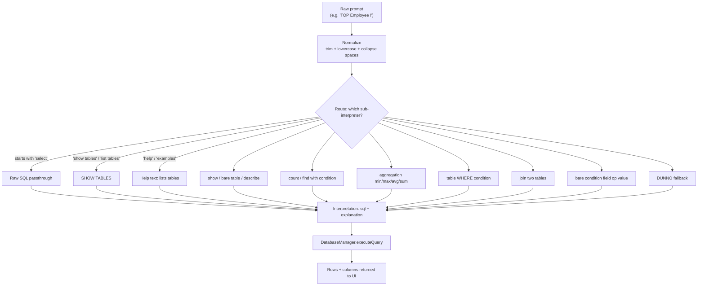

# How the SQL Prompt Interpreter Works

The heart of the feature is `SqlPromptInterpreter` (`src/main/kotlin/com/assistant/database/SqlPromptInterpreter.kt`).
It turns natural language into SQL in **four stages**, then hands the SQL to `DatabaseManager`
which executes it on the embedded H2 database.

## 1. The translation pipeline



The entry point is `interpret(prompt)`:

```kotlin
fun interpret(prompt: String): Interpretation {
    val clean = prompt.trim().lowercase().replace(RE_WS, " ")
    if (clean.startsWith("select")) return Interpretation(prompt, "Raw SQL passthrough")
    if (clean in SHOW_TABLES) return Interpretation("SHOW TABLES", "Showing all available tables")
    if (clean in HELP_WORDS) return Interpretation("", "Available tables: ...")
    return show(clean) ?: bareTable(clean) ?: describe(clean)
        ?: tableCond(clean, RE_COUNT, "COUNT(*) AS count")
        ?: tableCond(clean, RE_FIND, "*")
        ?: aggregation(clean)
        ?: tableCond(clean, RE_TABLE_WHERE, "*")
        ?: join(clean) ?: bareCondition(clean) ?: DUNNO
}
```

Each sub-interpreter returns `null` when it does **not** match, so the chain tries them in
priority order and stops at the first hit. If nothing matches, the interpreter returns `DUNNO`
(`sql = ""`, explanation `"I didn't understand"`).

## 2. Understanding: the resolution layer

Before any SQL is built, names are resolved against the live schema. Nothing is hardcoded —
the interpreter asks the database for its schema once and builds lookup indexes:

| Index | Built from | Purpose |
|-------|-----------|---------|
| `tableIndex` | `SHOW TABLES` → `TableInfo(name, columns)` | `employee` → `EMPLOYEES` |
| `columnIndex` | every column of every table | `salary` → `(employees, SALARY)` |
| `columnSynonyms` | column names + `COLUMN_ALIASES` map | `wage` → `salary`, `cena` → `price` |
| `knownValues` | `SELECT DISTINCT col FROM table` per text column | `engineering` → `departments.name` |

### Table resolution (with inflection)

`resolveTable()` understands singular/plural forms:

- exact match → `employees` → `EMPLOYEES`
- `employee` → `employees` (appends `s`)
- strips suffixes: `companies` → `company` (`-ies` → `-y`), `classes` → `class` (`-es`)

### Column resolution

`resolveField()` tries, in order:

1. exact column name (`salary`)
2. table name → its best numeric column (`product` → `products.price`)
3. synonym lookup (`wage` → `salary`)
4. prefix match (`sal` → `salary`)

When a table is used as a field, `pickNumericCol()` picks the numeric column that is **not** `id`
and does **not** end in `_id` — that's how `employee` in `"top employee"` resolves to `salary`.

### Value resolution (dynamic, not hardcoded)

Conditions like `find employees in Engineering` are resolved against **actual data**:
`knownValues` maps every distinct text value found in the DB (queried via
`DatabaseManager.queryDistinctValues`) to its `(table, column)`. So `Engineering` becomes

```sql
department_id = (SELECT id FROM departments WHERE LOWER(name) = 'engineering')
```

If you renamed a department, the interpreter would keep working — no code change needed.

## 3. Building SQL: the pattern → SQL table

| Pattern | Example | Generated SQL |
|---------|---------|---------------|
| Raw SQL | `SELECT * FROM employees WHERE salary > 70000` | passthrough, verbatim |
| Show tables | `show tables` | `SHOW TABLES` |
| Show / list / display table | `show employees` | `SELECT * FROM employees` |
| Bare table name | `employees` | `SELECT * FROM employees` |
| Describe structure | `describe employees` | `SELECT COLUMN_NAME, DATA_TYPE FROM INFORMATION_SCHEMA.COLUMNS WHERE TABLE_NAME = 'employees'` |
| Count | `count products` | `SELECT COUNT(*) AS count FROM products` |
| Find with condition | `find employees in Engineering` | `SELECT * FROM employees WHERE department_id = (SELECT id FROM departments WHERE LOWER(name) = 'engineering')` |
| Extreme value | `top employee` | `SELECT * FROM employees ORDER BY salary DESC LIMIT 1` |
| Lowest value | `cheapest product` | `SELECT * FROM products ORDER BY price ASC LIMIT 1` |
| Grouped aggregation | `average salary by department` | `SELECT departments.name AS group_name, CAST(AVG(a.salary) AS INT) AS AVG_salary FROM employees a JOIN departments ON a.department_id = departments.id GROUP BY departments.name ORDER BY AVG_salary DESC` |
| Join | `join employees and departments` | `SELECT a.*, departments.* FROM employees a JOIN departments ON a.department_id = departments.id` |
| Bare condition | `price > 900` | `SELECT * FROM products WHERE price > 900` |
| English operator | `price is greater than 900` | `SELECT * FROM products WHERE price > 900` |

## 4. Clever details worth knowing

- **FK inference, not hardcoding**: joins and cross-table aggregations find the foreign key by
  convention — a column ending in `_id` whose stem matches another table (`department_id` →
  `departments`). Joins are tried in both directions, then fall back to a cross-join.
- **Text vs numeric columns**: text columns are compared case-insensitively (`LOWER(col) = 'x'`)
  and values are quoted; numeric columns are compared raw. `cmpField()` decides based on whether
  the value looks like a number.
- **Aliased join output**: `join employees and departments` renames the joined columns
  (`departments.name AS departments_name`) so both tables' columns don't collide in the result.
- **Aggregation grouping**: `by` / `per` / `podle` / `dle` trigger `GROUP BY`. Grouped
  aggregations can even span two tables (e.g. `average salary by department` joins
  `employees` → `departments` automatically).
- **Czech support everywhere**: every intent has Czech keyword synonyms
  (`najdi`, `zobraz`, `kolik`, `prumer`, `nejdrazsi`…) — see [synonyms.md](synonyms.md).
- **Help & fallback**: `help` lists the tables and example patterns. Unrecognized input returns
  the `DUNNO` interpretation instead of failing.

## 5. After translation: execution

`SqlRoutes.kt` receives the prompt via `POST /sql/query`, calls `interpret()`, and:

1. If the generated SQL is empty → returns the help/explanation text (no query).
2. Otherwise → `db.executeQuery(sql)` → `(columns, rows, rowCount)`.
3. Responds with SQL, explanation, columns, rows, row count, and execution time — all shown in the UI.

Raw SQL power users bypass the interpreter entirely via `POST /sql/execute`.

> **Source files**: `SqlPromptInterpreter.kt`, `DatabaseManager.kt`, `SqlRoutes.kt`,
> web UI in `src/main/resources/web/index.html` (SQL tab, prompt chips via `GET /sql/prompts`).
