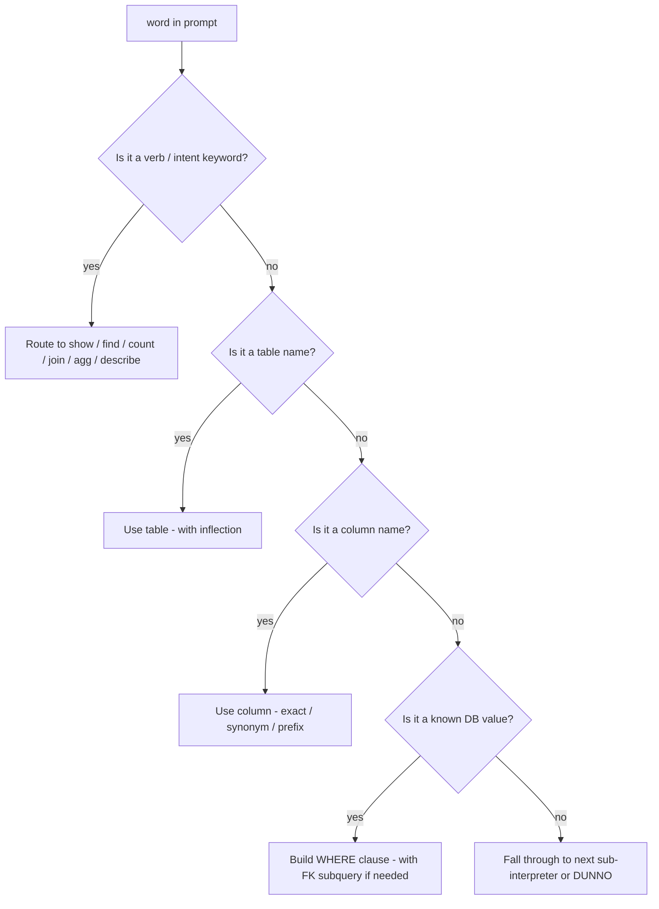

# Synonyms & Vocabulary — Everything the Interpreter Understands

The SQL assistant understands **English and Czech**, and every concept has multiple ways to say it.
This page is the complete catalog of words and rules — straight from the source code
(`SqlPromptInterpreter.kt`).

---

## 1. Intent keywords

### Show / list a table

| English | Czech |
|---------|-------|
| `show` | `zobraz` |
| `display` | `vsechny` (all) |
| `list` | |
| `all` | |
| `select` | |

Pattern: `show|display|list|all|select|zobraz|vsechny <table> [table]`

Examples: `show employees`, `display products`, `list departments`, `zobraz employees`.

### Show tables (special phrase)

| Phrase |
|--------|
| `show tables` |
| `list tables` |
| `tables` |

### Describe structure

| English | Czech |
|---------|-------|
| `describe` | |
| `structure` | |
| `schema` | |
| `info` | |

Pattern: `describe|structure|schema|info <table> [table]` → `INFORMATION_SCHEMA` query.

### Count

| English | Czech |
|---------|-------|
| `how many` | `pocet` (count) |
| `count` | `kolik` (how many) |

Pattern: `how many|count|pocet|kolik <thing> [in <condition>]`

Examples: `count products`, `how many employees`, `kolik employees`.

### Find / filter

| English | Czech |
|---------|-------|
| `find` | `najdi` |
| `search` | `vyhledej` |
| `select` | `ukaz` / `ukaz` |
| `get` | |
| `where` | |

Separators that introduce the condition:

| English | Czech |
|---------|-------|
| `in` | `v` / `ve` |
| `from` | `z` |
| `where` | `kde` |
| `with` | `s` |
| `that` | |

Pattern:
`find|search|select|get|where|najdi|vyhledej|ukaz <thing> [in|from|where|with|that|kde|s|v|ve|z <condition>]`

Examples: `find employees in Engineering`, `get products with price > 900`,
`najdi employees v Engineering`.

### Table + condition (no verb)

Pattern: `<table> in|from|v|z|with|s|kde|where <condition>`

Examples: `products with price > 900`, `products where price > 900`.

### Aggregation words → SQL function

| SQL function | English words | Czech words |
|--------------|---------------|-------------|
| **AVG** | `average`, `avg` | `prumer` |
| **SUM** | `sum`, `total` | `soucet` |
| **MIN** | `min`, `minimum`, `lowest`, `cheapest`, `most cheap` | `nejmensi`, `nejlevnejsi` |
| **MAX** | `max`, `maximum`, `top`, `highest`, `most expensive` | `nejvetsi`, `nejdrazsi` |

> **This is the key list for the headline example**: `top employee` → MAX on the best numeric
> column of `employees` (`salary`) → `ORDER BY salary DESC LIMIT 1`.

MIN words flip the sort to `ASC` (lowest first), MAX words to `DESC` (highest first).

### Grouping words (trigger `GROUP BY`)

| English | Czech |
|---------|-------|
| `by` | `podle` |
| `per` | `dle` |

Pattern: `<agg> <field> by|per|podle|dle <group>`

Examples: `average salary by department`, `sum price per category`.

### Join

| English | Czech |
|---------|-------|
| `join` | `spoj` |

Table connectors:

| English | Czech |
|---------|-------|
| `and` | `a` |
| `with` | `s` |

Pattern: `join|spoj <table1> and|with|a|s <table2>`

Examples: `join employees and departments`, `spoj employees a departments`.

### Bare condition operators

| Prompt operator | SQL operator |
|-----------------|--------------|
| `>` | `>` |
| `<` | `<` |
| `>=` | `>=` |
| `<=` | `<=` |
| `=` | `=` |
| `!=` | `!=` |
| `equals` | `=` |
| `is` | `=` |
| `like` | `LIKE` |

Pattern: `<field> <operator> <value>` — e.g. `price > 900`, `category is Electronics`.

### Help

| English | Czech |
|---------|-------|
| `help` | `napoveda` |
| `prompts` | `priklady` |
| `examples` | |
| `commands` | |

---

## 2. Column synonyms (hardcoded aliases)

Column names are also understood under these synonyms (`COLUMN_ALIASES`):

| Synonym | Resolves to |
|---------|-------------|
| `wage` | `salary` |
| `income` | `salary` |
| `plat` | `salary` |
| `jmeno` | `name` |
| `oddeleni` | `department_id` |
| `cena` | `price` |
| `cost` | `price` |
| `skladem` | `stock` |
| `quantity` | `stock` |
| `kategorie` | `category` |
| `misto` | `location` |
| `city` | `location` |
| `nastup` | `hire_date` |
| `datum` | `date` |

## 3. Automatic name normalization

Beyond the hardcoded lists, the interpreter **derives** synonyms from the schema itself
(`buildColumnSynonyms()`). For every column it registers:

- the exact name: `salary`
- stripped `_id` / `_fk` suffixes: `department` ← `department_id`
- underscores → spaces: `hire date` ← `hire_date`
- underscores removed: `hiredate` ← `hire_date`

Table names are matched with singular/plural inflection:

- exact: `employees`
- +`s`: `employee` → `employees`
- `-ies` → `-y`: `companies` → `company`
- `-es` stripped: `classes` → `class`

## 4. Value matching (data-driven, zero hardcoding)

Filter values are matched against **actual database content**. At startup the interpreter runs
`SELECT DISTINCT <col> FROM <table>` for every text column and indexes the values. That's why:

- `find employees in Engineering` works (`Engineering` is a real `departments.name`),
- `find employees in Prague` would also work (`Prague` is a real `departments.location`),
- renaming a department in the DB keeps the interpreter working with **no code change**.

Values are compared case-insensitively (`LOWER(col) = 'engineering'`). Foreign-key columns
(`department_id`) are matched via subquery so you never need to know numeric IDs.

## 5. Summary: the "understand a word" decision tree

## 6. What the interpreter does NOT understand

To set expectations: the interpreter is **pattern-based**, not an LLM. It will not understand:

- multi-step reasoning ("show me the second cheapest product that's in stock")
- implicit joins without a join word
- negative conditions ("all products except Electronics")
- aggregate conditions ("departments with more than 3 employees")

Those prompts fall through to `DUNNO` (`"I didn't understand"`) — or you can always fall back to
**raw SQL** by typing a prompt that starts with `select`.
